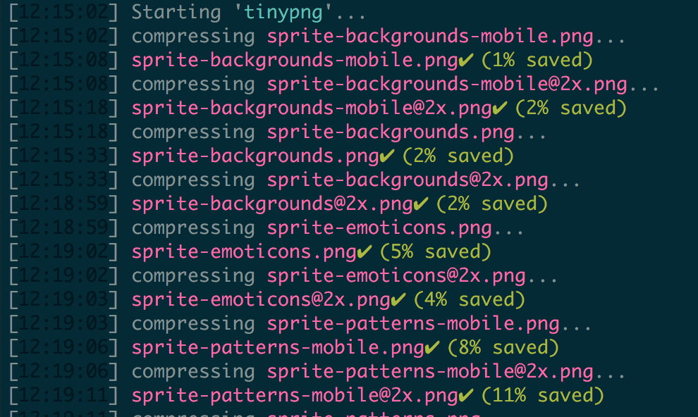

# gulp-tinifier
gulp-tinifier is a simple plugin which allows you to compress your images with [https://tinypng.com/](https://tinypng.com/) service



## Install

```bash
  npm install gulp-tinifier --save
```

## How it works
tinifier has a simple sintax accepts one only argument

```javascript

  var tinfier = require('gulp-tinifier');
  
  ...
  
  var options = {
      key:'YOUR_API_KEY',
      verbose: true
  }
  
  gulp.src(imgToCompress)
    .pipe(tinfier(options))
    .pipe(gulp.dest("sprites-optimized", {cwd:distFolder}))
    
  ...
  
```

`options` is an object and has the following proprieties

  - *key* [string] your API key (you can grab it from [https://tinypng.com/developers](https://tinypng.com/developers) )
  - *verbose* [boolean] true by default, it will show the progress in the console
 

## Example

```javascript

var tinfier = require('gulp-tinifier');

var config = require('./gulp.config.js');
var imgToCompress = [
    config.dist + "assets/img/sprite-backgrounds@2x.png",
    config.dist + "assets/img/sprite-backgrounds-mobile@2x.png"
];
var distFolder = config.dist + "assets/img/";

module.exports = function(gulp) {
    return gulp.task("tinypng", function(done) {
        gulp.src(imgToCompress)
            .pipe(tinfier({
                key:'YOUR_API_KEY',
                verbose: true
            }))
            .pipe(gulp.dest("sprites-optimized", {cwd:distFolder}))
    })
}

```
